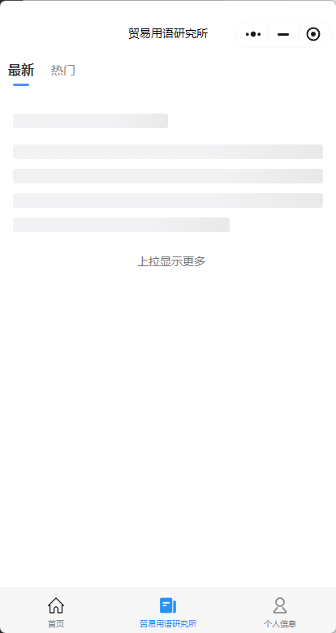
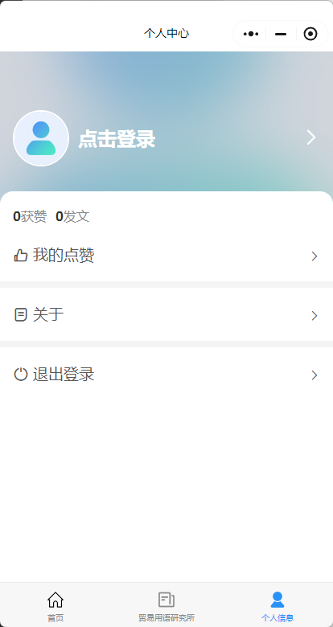

# Trade-Talk (贸易说)

> A Professional English Learning Platform for International Trade Practitioners

[简体中文](./README.md) | English

## Repository

- GitHub: https://github.com/Kaguranotamashii/Trade-Talk
- Stars: [](https://github.com/Kaguranotamashii/Trade-Talk/stargazers)
- License: [](./LICENSE)

## 项目简介

"贸易说小程序"是一个面向外贸从业者的专业英语学习平台,该项目是2022年参加大学生计算机设计大赛的参赛作品.平台旨在为外贸从业者提供专业的英语学习环境,帮助用户提升商务英语水平,增强跨文化交际能力.

## 项目截图





## 核心模块实现

### 1. 专业词汇学习模块
- 采用`art_word_list`云函数动态加载分类词汇(参见uniCloud-aliyun/cloudfunctions/art_word_list)
```javascript
// pages/SpecificWords/SpecificWords.vue 数据加载逻辑
uniCloud.callFunction({
  name: 'art_word_list',
  data: { category_id: this.activeCategory }
})
```

### 2. 文章阅读模块
- 使用`u-parse`组件渲染富文本内容(集成于pages/detail/detail.vue)
- 分页查询通过art_get_all云函数实现:
```javascript
// 云函数art_get_all分页逻辑
db.collection('article')
  .skip(event.page * 10)
  .limit(10)
  .get()
```

### 1. 专业词汇学习
- 外贸专业词汇库
- 词汇分类学习
- 个性化词汇列表

### 2. 文章阅读
- 外贸实战案例
- 商务英语文章
- 热门话题解析

### 3. 用户论坛
- 经验交流
- 问题讨论
- 资源分享

### 4. 个人中心
- 学习进度追踪
- 收藏管理
- 个人信息设置

## 技术架构

### 项目构建
- 通过`package.json`配置uni-app编译预设,使用`@dcloudio/vue-cli-plugin-uni`脚手架
- 页面路由通过`pages.json`统一管理,支持微信小程序分包加载(参见/pages/*目录结构)

### 前端实现
- 基于uni-app跨平台框架构建,通过条件编译实现多端适配
- 核心页面采用Vue单文件组件开发,配合uView UI组件库实现:
  - 论坛页使用`u-tabs-swiper`实现滑动选项卡
  - 词汇详情页集成百度翻译API实现即时查词
  - 个人中心采用`u-form`表单验证逻辑
- 全局样式通过uni.scss管理主题色($main-color: #2979ff)

### 云服务配置
- uniCloud云函数部署:
  - art_get_all:实现文章分页查询(pagesize=10)
  - art_word_list:支持按category_id筛选专业词汇
- 数据库设计:
  ```json
  // user表结构
  {
    "_id": "用户ID",
    "study_progress": {"vocabulary": 0, "article": 0}
  }
  ```

### 数据库优化
- 在dicts表建立category_id索引加速查询:
```javascript
// 云函数art_word_list查询示例
db.collection('dicts')
  .where({ category_id: '贸易术语' })
  .field({ term:1, definition:1 })
  .get()
```

## 数据库设计

### 用户表(user)
```json
{
  "_id": "ObjectID",
  "username": "加密存储(采用uni-id的password加密策略)",
  "study_progress": {
    "vocabulary": 0,
    "article": 0
  },
  "last_login": "Date"
}
```

### 专业词汇表(dicts)
```json
{
  "term": "FOB",
  "category_id": "贸易术语",
  "definition": "Free On Board的缩写...",
  "examples": [
    {
      "sentence": "We offer $500 per unit FOB Shanghai.",
      "translation": "我们的报价是每件500美元上海离岸价."
    }
  ]
}
```

### 文章表(article)
```json
{
  "title": "国际贸易谈判技巧",
  "content": "...包含u-parse组件渲染的富文本...",
  "view_count": 0,
  "category": "实战案例"
}
```

### 云函数模块
- 文章获取(art_get_all)
- 词汇列表(art_word_list)
- 用户管理

## 项目特色

1. **专业性**
   - 针对外贸领域的专业英语内容
   - 实用的商务场景案例

2. **实用性**
   - 贴近外贸工作实际需求
   - 提供实战应用指导

3. **交互性**
   - 用户间经验交流
   - 问题互助平台

## 典型页面实现

### 论坛页(pages/forum/forum.vue)
- 使用`u-tabs-swiper`实现选项卡滑动切换:
```vue
<u-tabs-swiper
  ref="uTabs"
  :list="tabList"
  :current="current"
  @change="tabChange"
></u-tabs-swiper>
```

### 个人中心(pages/personal/personal.vue)
- 表单验证采用uView的`u-form`组件:
```vue
<u-form
  :model="form"
  :rules="rules"
  ref="uForm"
>
  <u-form-item label="邮箱" prop="email">
    <u-input v-model="form.email" />
  </u-form-item>
</u-form>
```

## 项目团队

- 项目指导教师:xxx
- 开发团队成员:xxx

## 获奖情况

2022年参加中国大学生计算机设计大赛

## 技术支持

- 前端框架:uni-app
- UI框架:uView UI v1.8.6
- 后端服务:uniCloud
- 数据库:云数据库

## 安全措施
- 用户密码采用uni-id的`passwordHash`加密存储(参见uniCloud-aliyun/database/user.schema.json)
- 百度翻译API调用通过MD5签名加密(实现逻辑见static/js/md5.js)
- 敏感操作增加权限验证:
```javascript
// 云函数art_get_row权限校验
if(!context.UNI_ID_TOKEN) {
  return { code: 403, msg: '未授权访问' }
}
```

## 联系方式

如需技术支持或反馈建议,请通过[GitHub Issues](https://github.com/Kaguranotamashii/Trade-Talk/issues)与我们沟通.

## 开源许可

本项目采用 [MIT](./LICENSE) 开源许可证.

## 版权信息

© 2022 贸易说团队 保留所有权利